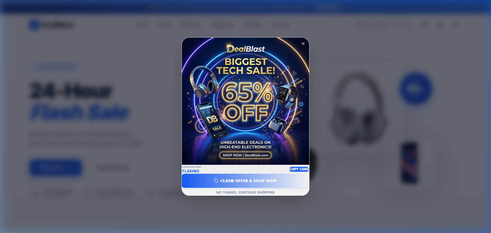
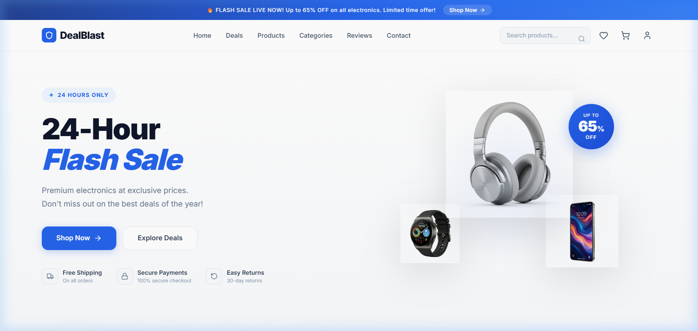

# ⚡ DealBlast - Premium 24-Hour Flash-Sale Electronics Platform

DealBlast is a highly interactive, modern, and conversion-focused single-page e-commerce web application specialized in limited-time consumer electronics deals. Engineered with rich aesthetics, real-time feedback, and urgency design patterns to simulate an authentic high-converting e-commerce flash sale.

---

## 📸 Project Showcases

### 🎁 Exclusive Entry Promotional Offer
When users first land on DealBlast, they are greeted by an elegant, high-impact overlay modal that triggers a 65% OFF coupon banner with full copy-to-clipboard functionality:



### 🛒 High-Fidelity Flash Sale Homepage
A dark-theme dashboard featuring interactive category badges, stock availability progress meters, live ratings, localized Indian Rupees (₹) pricing, and micro-animated product interactions:



---

## ✨ Key Features

- **⏱️ LiveUrgency Countdown Clock**: A centralized 5-minute ticking timer. When the sale ends, shopping buttons automatically disable, checkout locks, and interactive items show a "Sale Ended" warning.
- **🛒 Dynamic Slide-in Cart Drawer**: Adjust quantities, remove items, copy promo codes, and preview the checkout total in Indian Rupees (₹) instantly with smooth entry/exit animations.
- **❤️ Wishlist Drawer**: Toggle favorite items from the catalog directly into a sliding wishlist panel.
- **🎫 Promo Coupon Clip System**: Integrated clipboard copy support (`navigator.clipboard`) for the promotional coupon code `FLASH65` with floating notifications.
- **🔥 Scarcity Indicators**: Custom progress bars representing real-time stock limits (e.g. "Only 8 left in stock").
- **✨ Premium Micro-Animations**: Hand-tailored hover scales, spring physics, and staggered entrance transitions powered by Framer Motion.
- **📱 Fully Responsive Design**: Seamless fluid layouts from compact mobile viewports to large-screen desktops.

---

## 🛠️ Technology Stack

- **Framework**: [React 19](https://react.dev/)
- **Build Tool**: [Vite](https://vitejs.dev/)
- **Styling**: [Tailwind CSS v4](https://tailwindcss.com/)
- **Animations**: [Framer Motion](https://www.framer.com/motion/)
- **Icons**: [Lucide React](https://lucide.dev/)
- **State Management**: React Context API (`SaleContext.jsx`)

---

## 🚀 Getting Started

### 📋 Prerequisites
Ensure you have [Node.js](https://nodejs.org/) (v18+ recommended) and npm installed.

### ⚙️ Installation
1. Clone the repository:
   ```bash
   git clone https://github.com/avikmasanta/DealBlast.git
   cd DealBlast
   ```

2. Install dependencies:
   ```bash
   npm install
   ```

3. Run the development server:
   ```bash
   npm run dev
   ```
   Open [http://localhost:5173](http://localhost:5173) in your browser to experience DealBlast.

4. Build the application for production:
   ```bash
   npm run build
   ```

---

## 📖 Component Structure
```text
src/
├── assets/         # Brand iconography and SVG assets
├── components/
│   ├── AnnouncementBar.jsx   # Scrolling hot-deals ticker
│   ├── Navbar.jsx            # Branding, wishlist/cart toggle icons & badges
│   ├── Hero.jsx              # Main call-to-action & product staging
│   ├── Countdown.jsx         # Urgency countdown clock
│   ├── Categories.jsx        # Badges grid for product types
│   ├── FeaturedProducts.jsx  # Interactive catalog cards with stock meters
│   ├── DealOfTheDay.jsx      # Highlighted deep-discount electronic item
│   ├── Features.jsx          # Security, shipping, and return guarantees
│   ├── Testimonials.jsx      # Customer review grids
│   ├── Newsletter.jsx        # Discount sign-up footer subscription box
│   ├── Footer.jsx            # Multi-column navigational links
│   ├── SalesPopup.jsx        # 65% off promo banner coupon modal
│   ├── CartDrawer.jsx        # Cart items list, coupon box & checkout calculations
│   ├── WishlistDrawer.jsx    # Wishlist drawer panel
│   └── Toast.jsx             # Global toast alert notification portal
├── context/
│   └── SaleContext.jsx       # Global state manager (cart, wishlist, timer, toasts)
├── App.jsx                   # Central page assembler
└── index.css                 # Custom styles and Tailwind imports
```

---

## 🎨 Design Systems & Palette
- **Primary Background**: High-end deep slate/ebony gradients.
- **Accent Highlight**: Vibrant Neon Electric Blue (`#2563EB`) & Gold/Amber Rose details.
- **Typography**: Google Fonts Inter & Outfit.

---

## 📄 License
This project is open-source and available under the MIT License.
